# Jam Tracks Hub

<div align="center">
  <p><strong>Pick a backing track. Understand the harmony. Make the song your own.</strong></p>
  <p>Original backing tracks, practical guitar tools, and a local-first song workspace—built by Jasper for focused practice, with no sign-in required.</p>
  <p>
    <a href="https://jamtrackshub.com/#home">Live Site</a> ·
    <a href="https://jamtrackshub.com/song-workspace.html">Song Workspace</a> ·
    <a href="https://www.youtube.com/@Weekly_Backing_Track">YouTube</a> ·
    <a href="#website-analytics">Analytics</a> ·
    <a href="#local-development">Local Development</a>
  </p>
  <p>
    <a href="https://github.com/Jasper-hsury/Jam_Tracks_Hub/actions/workflows/ci.yml">
      
    </a>
    <a href="https://jamtrackshub.com">
      
    </a>
    
  </p>
</div>

Start with an original backing track, explore its key and chord shapes, then organize your own chord-and-lyric chart. English and Traditional Chinese interfaces, light/dark themes, and responsive layouts support practice on desktop and mobile.

<!-- UMAMI_ANALYTICS_START -->
## Website Analytics

Daily Umami analytics snapshot for Jam Tracks Hub.

Last updated: Sep 19, 2026, 8:21 AM

<p align="center">
  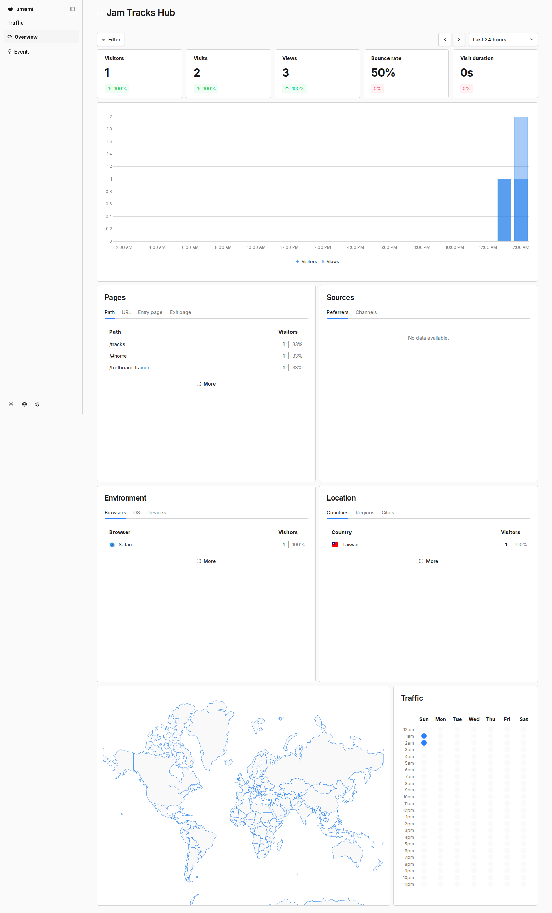
</p>
<!-- UMAMI_ANALYTICS_END -->

**All Time** describes the dashboard's reporting range: the analytics available across its recorded history at capture time, not just the previous day. **Daily** describes how often the snapshot is refreshed. This is a saved image, not a live dashboard; the timestamp above identifies its last update. The automation verifies All Time before capturing and retains the last good snapshot when validation fails.

## Choose Your Practice Flow

| Goal | Start here | What you can do |
| --- | --- | --- |
| Practice | [Backing Tracks](https://jamtrackshub.com/tracks.html) · [Fretboard Trainer](https://jamtrackshub.com/fretboard-trainer.html) | Filter tracks by relative-key groups, sort newest/oldest, follow available YouTube links, download practice slides, and learn note positions. |
| Understand | [Key Finder](https://jamtrackshub.com/key-finder.html) · [Scale Explorer](https://jamtrackshub.com/scale.html) · [Chord Dictionary](https://jamtrackshub.com/chord-dictionary.html) | Estimate a tonal center, map scales on a fretboard, and compare guitar chord voicings. |
| Create | [Chord Progressions](https://jamtrackshub.com/chord-progressions.html) · [Progression Writer](https://jamtrackshub.com/progression-writer.html) | Explore common progressions, write your own, save/load and duplicate them locally, and export JSON or chord diagrams. |
| Play your songs | [Song Workspace](https://jamtrackshub.com/song-workspace.html) | Arrange chord-and-lyric charts, transpose, choose capo positions, and use Read or Performance Mode. |

## Product Showcase

### Homepage

[Open Homepage](https://jamtrackshub.com/#home) — A starting point connecting original backing tracks, music-theory tools, and Song Workspace through practical workflows.

<p align="center">
  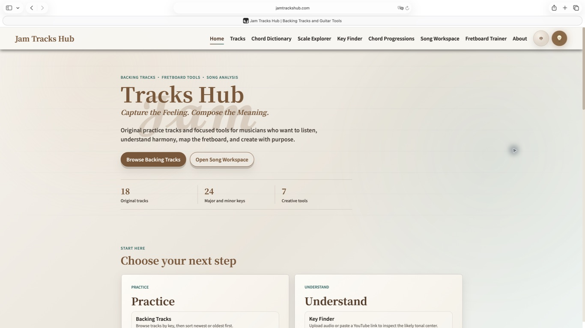
</p>

### Tracks

[Browse Tracks](https://jamtrackshub.com/tracks.html) — Filter backing tracks by key, sort newest or oldest first, and open the available listening links and downloadable practice resources.

<p align="center">
  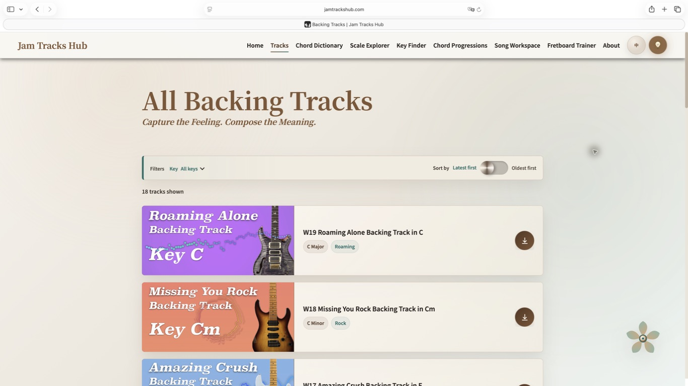
</p>

### Chord Dictionary

[Open Chord Dictionary](https://jamtrackshub.com/chord-dictionary.html) — Choose a root and chord type to compare its formula, notes, and guitar shapes, with filters for fret position and string sets. The preview shows C major.

<p align="center">
  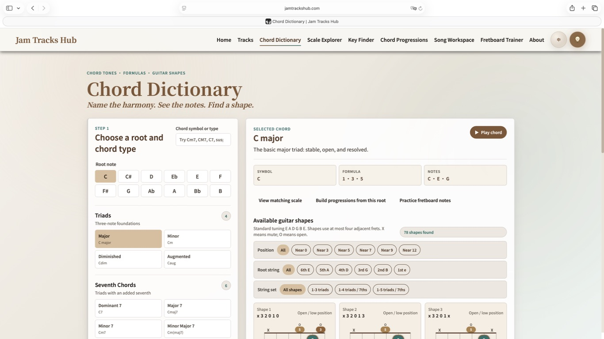
</p>

### Key Finder

[Open Key Finder](https://jamtrackshub.com/key-finder.html) — Upload audio to estimate its likely key or tonal center, or try a YouTube link when the analysis service can access the video. Results are listening aids, not guarantees; audio upload or the optional local helper offers an alternative when YouTube access fails.

<p align="center">
  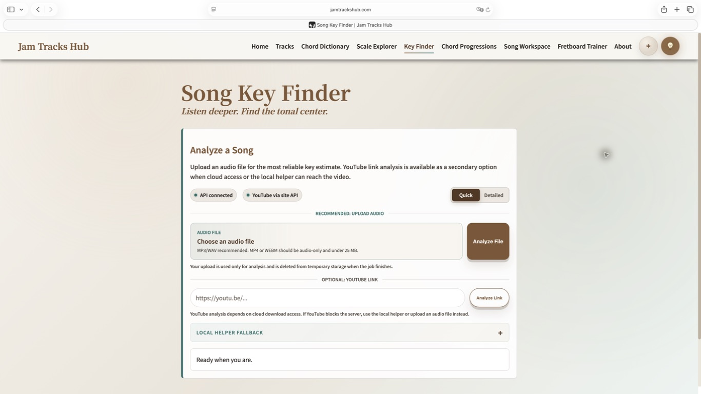
</p>

### Song Workspace

[Open Song Workspace](https://jamtrackshub.com/song-workspace.html) — A local-first songbook for your own chord-and-lyric charts, with no account required.

- **Create and arrange:** start with Chords + Lyrics, Lyrics Only, or Chords Only; organize sections, align chords with lyrics, and choose chord shapes.
- **Adapt the chart:** transpose, set Capo, and compare Smart Capo suggestions; Shape Key is what you play and Target Key is what sounds. Choose Original, Easy: Balanced, Easy: Beginner, Roman, or Nashville display.
- **Practice and perform:** use Read Mode or Performance Mode with adjustable auto-scroll and chart zoom.
- **Import and back up:** exchange ChordPro or JTH JSON songs and use Backup All / Restore Backup for the library. JTH JSON preserves the complete song project; ChordPro is not an identical backup.

Songs stay in this browser's IndexedDB, with display preferences in local storage; there is no remote song storage or cloud sync, and Song Workspace song/document content is not uploaded to Jam Tracks Hub. Clearing browser data can remove the library, and another browser/device does not share it—keep exported backups. Other features, including analytics and Key Finder, may use network services. Only import or share material you have rights to use; see [Legal & Usage Policy](https://jamtrackshub.com/legal.html) and [Privacy Policy](https://jamtrackshub.com/privacy-policy.html).

<p align="center">
  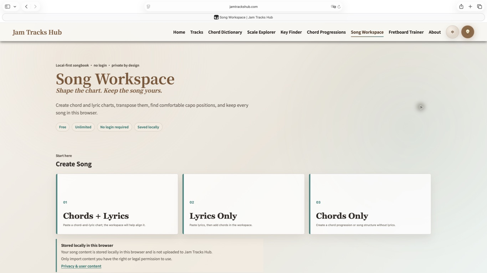
</p>

The screenshot shows the creation/start screen, not an active editor or Performance Mode.

### Progression Writer

[Open Progression Writer](https://jamtrackshub.com/progression-writer.html) — Build progressions with or without verse/chorus sections, compare chord shapes, save/load or duplicate them locally, and export JSON or chord diagrams. This is separate from Song Workspace's chord-and-lyric songbook.

<p align="center">
  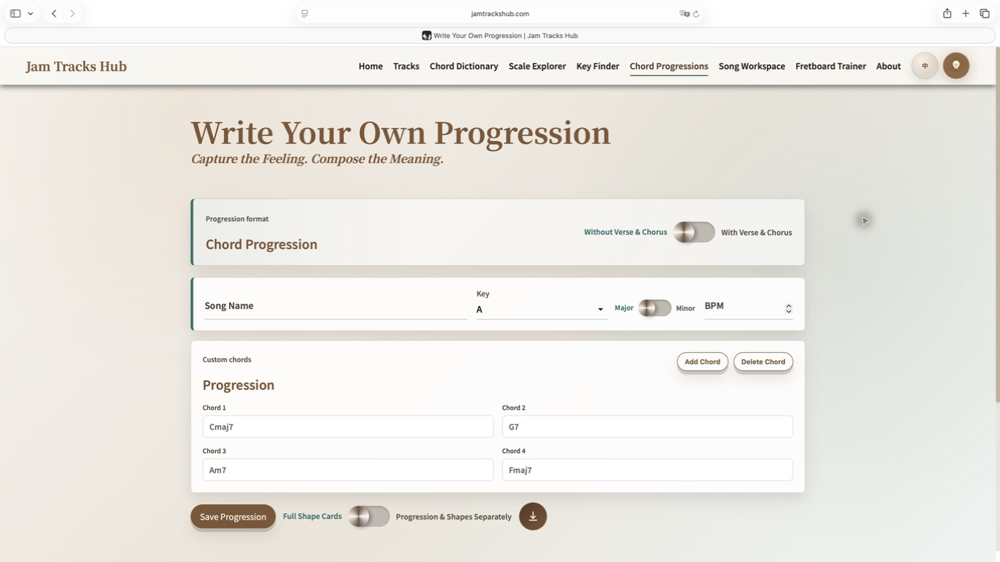
</p>

## Full Product Gallery

### Music Tools

#### Scale Explorer

[Open Scale Explorer](https://jamtrackshub.com/scale.html) — Explore scale notes and intervals, map them on a guitar fretboard, and download a labeled PNG.

<p align="center">
  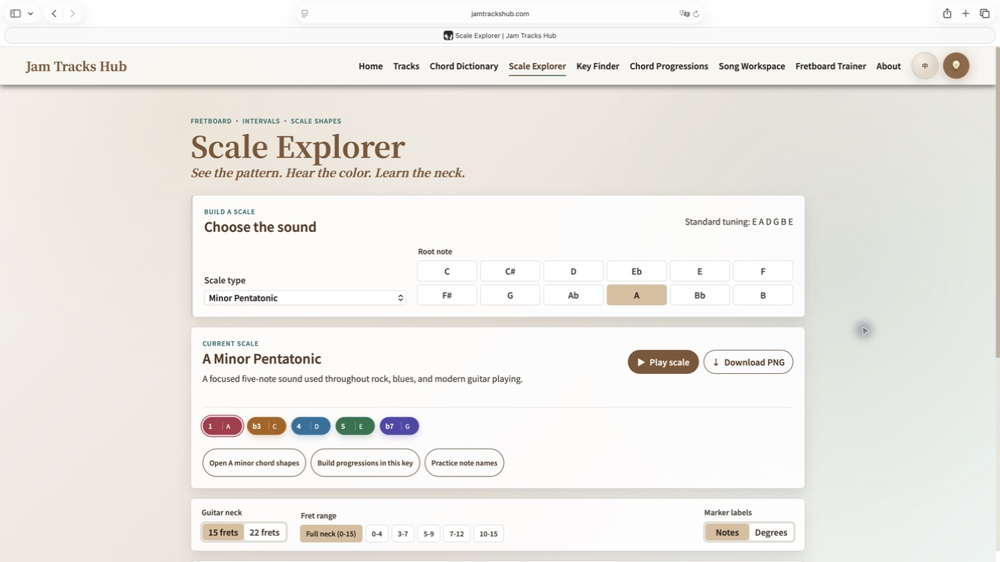
</p>

#### Chord Progressions

[Open Chord Progressions](https://jamtrackshub.com/chord-progressions.html) — Select a key and compare common progressions using triads or seventh chords with guitar shapes.

<p align="center">
  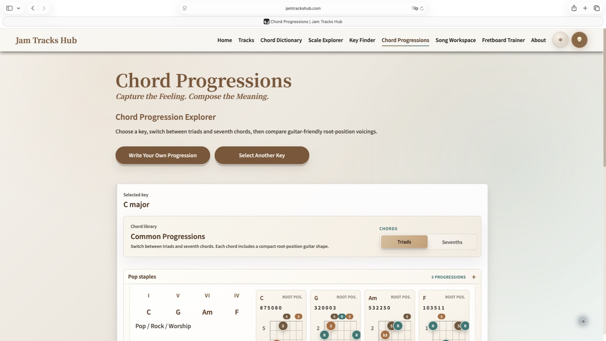
</p>

#### Fretboard Trainer

[Open Fretboard Trainer](https://jamtrackshub.com/fretboard-trainer.html) — Practice note names by answering string-and-fret questions in standard tuning.

<p align="center">
  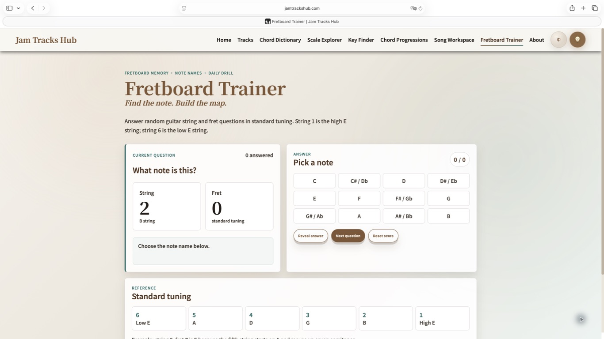
</p>

### Feedback / Service

#### Feedback

[Open Feedback](https://jamtrackshub.com/feedback.html) — Share suggestions about practice tools, backing tracks, or the site experience.

<p align="center">
  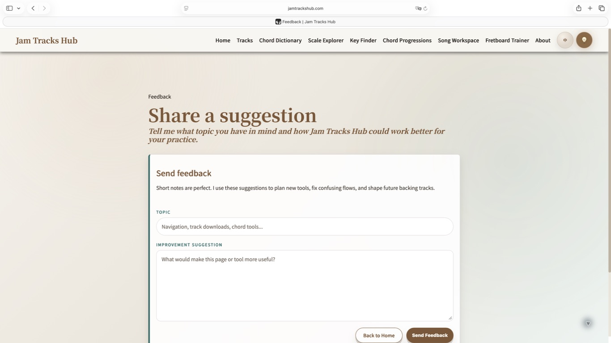
</p>

#### Service Waking

[Open Service Waking](https://jamtrackshub.com/service-waking.html) — Check the analyzer's readiness during startup and return to Key Finder when it is ready.

<p align="center">
  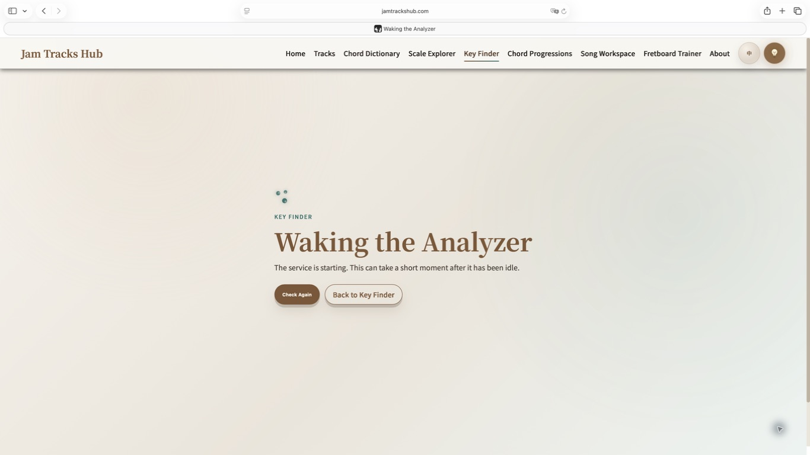
</p>

### Policy / Error Pages

#### Legal

[Open Legal](https://jamtrackshub.com/legal.html) — Usage, copyright, and local-content responsibilities.

<p align="center">
  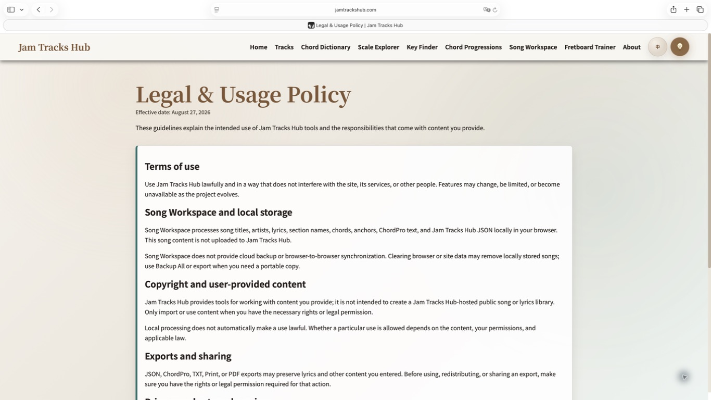
</p>

#### Privacy

[Open Privacy](https://jamtrackshub.com/privacy-policy.html) — Data processing and user-content boundaries.

<p align="center">
  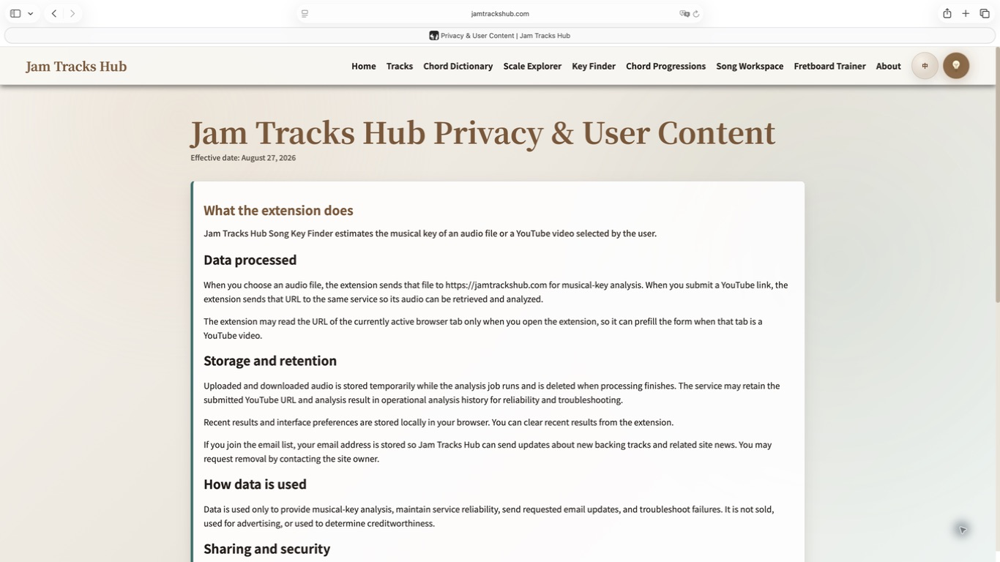
</p>

#### 404

[View 404 Page](https://jamtrackshub.com/404.html) — A missing-page message with links back to the site.

<p align="center">
  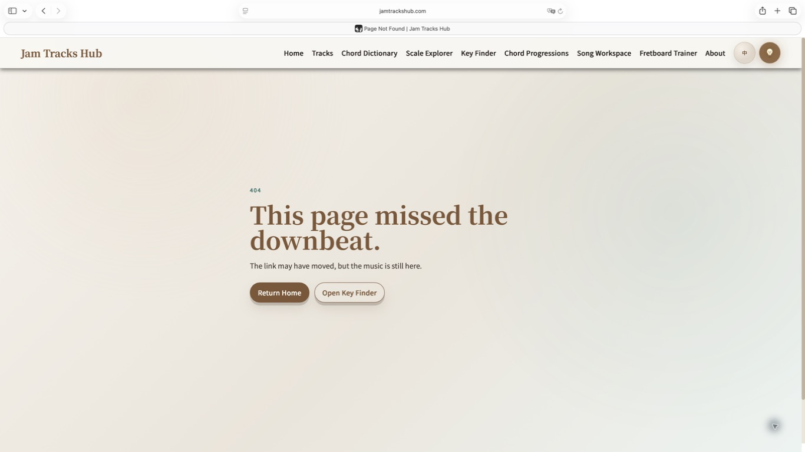
</p>

## Releases and Development

- [v2.0.6 — Reliable All-Time Analytics Snapshots](https://github.com/Jasper-hsury/Jam_Tracks_Hub/releases/tag/v2.0.6): the published maintenance release for All Time selection, screenshot validation, and analytics automation reliability.
- [Development Log](https://github.com/Jasper-hsury/Jam_Tracks_Hub_Development_Log): public development history, release notes, and product evolution in the separate log repository.
- [GitHub Workflow](docs/GITHUB_WORKFLOW.md): contribution and review process.

The published release tag is `v2.0.6`; this checkout's `package.json` still declares `2.0.5`. These are distinct records, and this README refresh does not change either.

## Local Development

Use Node **22.23.2** from [.nvmrc](.nvmrc). From the repository root:

```bash
npm ci
npm run dev
```

Open the Vite URL printed in the terminal (normally `http://127.0.0.1:5173/`). Keep the frontend on Vite for Vue module compilation; `8000` is the local Key Finder API port, not the Vite development server.

### Optional Key Finder backend

The frontend and browser-local tools can be developed without running analysis. To test Key Finder analysis locally, start its FastAPI backend in a separate terminal with Python 3.10 or newer.

On macOS:

```bash
bash tools/mac/start_render_local_mac.sh
```

On Windows PowerShell, using the same Python interpreter for installation and startup:

```powershell
python -m pip install -r api-server/requirements_api.txt
python -m uvicorn app:app --host 127.0.0.1 --port 8000 --app-dir api-server
```

The macOS helper creates a virtual environment and installs the API requirements before startup. The API health endpoint is `http://127.0.0.1:8000/api/health`; continue browsing the frontend at the Vite URL. Analysis requires network/service access where applicable; normal UI inspection does not require uploading a file or starting a job.

## Checks

Run the full local test suite, JavaScript syntax checks, and production-output verification:

```bash
npm test
npm run check
npm run build:cloudflare
npm run verify:cloudflare
git diff --check
```

`build:cloudflare` builds the Vue entries, prepares retained static assets in `dist/`, and runs output verification. It does not deploy. `verify:cloudflare` can also be run separately. There are no dedicated lint or type-check scripts; `check` is JavaScript syntax validation.

## Architecture and Data

The frontend is a Vue 3 multi-page application built with Vite: 14 visible HTML entries, including utility/policy pages, plus a build-only foundation entry. Root HTML files retain stable URLs, metadata, analytics loading, and early theme/locale setup. See the [Vue migration record](docs/VUE_MIGRATION.md) for the retained classic-script bridges.

| Path | Responsibility |
| --- | --- |
| `src/entries/`, `src/views/`, `src/components/site/` | Page entry points, Vue interfaces, and shared navigation/footer. |
| `src/composables/`, `src/music/`, `src/services/` | Reactive page behavior, music-domain logic, storage/export and API adapters. |
| `scripts/song-workspace-core.js`, `scripts/song-workspace-storage.js`, `scripts/song-workspace-import.js` | Retained Song Workspace domain, browser storage, and import modules. |
| `locales/`, `styles/` | English/Traditional Chinese text and shared/page styling. |
| `data/tracks.json` | Canonical track identities, music metadata, covers, YouTube and download links. |
| `slides/`, `downloads/`, `assets/` | Practice resources, artwork, and README/analytics images. |
| `api-server/` | FastAPI key-analysis service and Python dependencies. |
| `worker.js`, `functions/api/` | Site Worker and API handlers, including feedback/subscription services. |
| `tests/`, `tools/`, `docs/` | Regression coverage, maintenance/build helpers, and project documentation. |

Track `key`, `style`, `mood`, and `bpm` are distinct data fields. Some BPM values are empty; do not invent values or infer metadata from song titles. Consult the actual [track data](data/tracks.json) rather than a fabricated sample record.

### Key Finder API

The current frontend uses asynchronous analysis jobs and polls their status:

| Method | Endpoint | Purpose |
| --- | --- | --- |
| GET | `/api/health` | Service readiness |
| POST | `/api/analyze-file/jobs` | Create an audio-upload analysis job |
| GET | `/api/analyze-file/jobs/{jobId}` | Poll the audio job |
| POST | `/api/analyze/jobs` | Create a YouTube-link analysis job |
| GET | `/api/analyze/jobs/{jobId}` | Poll the YouTube job |

See [the frontend API adapter](src/services/keyFinderApi.mjs) and [FastAPI implementation](api-server/app.py). Local development defaults to `http://127.0.0.1:8000`; production analysis uses `https://api.jamtrackshub.com`.

## Automation

| Workflow | Purpose |
| --- | --- |
| [CI](.github/workflows/ci.yml) | Runs tests, JavaScript syntax checks, and Cloudflare build/output verification. |
| [Umami analytics report](.github/workflows/umami-analytics.yml) | Creates analytics issue reports when Umami API access is configured. |
| [Umami README snapshot](.github/workflows/umami-readme-screenshot.yml) | Captures a validated All Time dashboard snapshot for the daily README update. |

The current analytics image remains at `assets/analytics/umami-dashboard.png`; dated copies use `assets/analytics/history/YYYY-MM-DD.png`. The snapshot updater owns only the marked analytics block in this README. Explanatory text outside those markers is maintained separately.

For operational details, see [Umami analytics](docs/UMAMI_ANALYTICS_ACTION.md) and [subscription setup](docs/SUBSCRIBE_SETUP.md). Do not put share credentials, tokens, or subscriber data in documentation.

## License

Jam Tracks Hub uses a split licensing model. Original source code and software components are available under the [MIT License](LICENSE), except where otherwise noted. Repository-level MIT license detection applies only to that covered software and does not extend to the excluded content below.

| Material | License / Rights |
| --- | --- |
| Source code and software components | [MIT License](LICENSE), except where otherwise noted |
| Audio files and backing tracks | All rights reserved unless separately licensed |
| Downloadable ZIP/PDF music resources | All rights reserved unless separately licensed |
| Images and artwork | All rights reserved unless separately licensed |
| Jam Tracks Hub logos, wordmarks, and other brand assets | All rights reserved; no trademark or brand-use rights granted |
| Third-party materials | Their respective licenses and copyright terms |

See [Content and Brand Rights](LICENSE-CONTENT.md) for the complete scope and exclusions.
